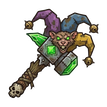

<div align="center" style="width:100%;">
<p style="text-align:center; background-color: white; width:fit-content;border-radius:999px; padding:10px">
  
  </p>
</div>

# Foolhammer Mod Manager

Hopefully, a simple and straightforward mod manager for Total War games.

## Features

- Profiles
- Mod groups
- First-party Linux support

## Planned

- Profile export (pack files + profile JSON)
- Windows support
- Steamworks integration (subscribe/unsubscribe)

## Supported Games

- **Total War: Warhammer III**

To add another title: add its defaults in `src-tauri/src/defaults/games.rs`, a game icon under `public/images/games/`, and a translation entry in the locale file(s).
 
## Prerequisites

Before you begin, ensure you have the following installed:
- [Node.js](https://nodejs.org/) (>=24.13.0)
- [pnpm](https://pnpm.io/) package manager
- [Rust](https://rustup.rs/) and Cargo
- [Tauri prerequisites](https://v2.tauri.app/start/prerequisites/) for your platform

## Getting Started

### Installation

1. Clone the repository:
```bash
git clone https://github.com/tpkee/foolhammer-mod-manager.git
cd foolhammer-mod-manager
```

2. Install dependencies:
```bash
pnpm install
```

### Development

Run the app:
```bash
pnpm dev
```

## Contributing

Contributions are welcome! Please feel free to submit a Pull Request.

> **Note:** No AI slop pls 

## License

This project is licensed under the MIT License - see the [LICENSE](LICENSE) file for details.

## Acknowledgments

- Built with [Tauri](https://tauri.app/)
- Uses [RPFM Library](https://github.com/Frodo45127/rpfm) for pack file management
- Steam integration via [steamworks-rs](https://github.com/Thinkofname/steamworks-rs)

## Issues

If you encounter any issues or have suggestions, please [open an issue](https://github.com/tpkee/foolhammer-mod-manager/issues) on GitHub.

---

**Note:** This project is in active development. Features and documentation may change.
